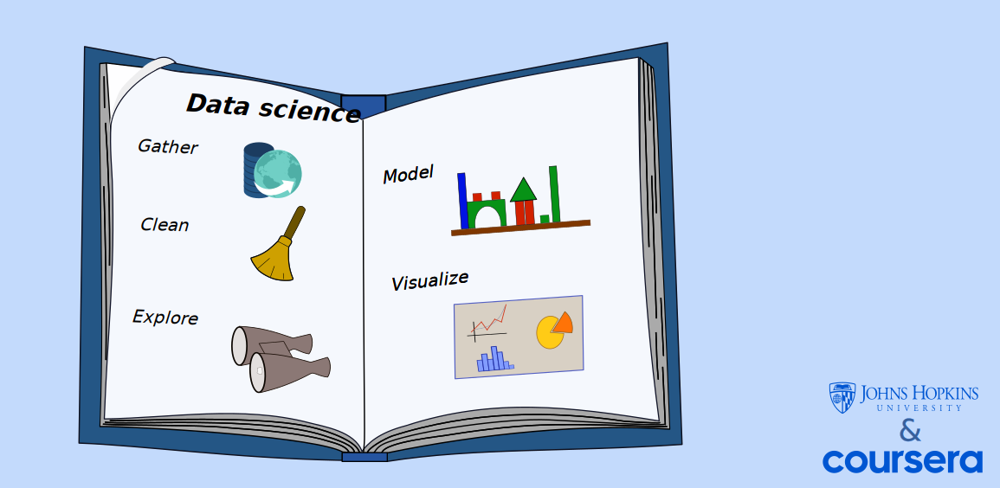

--- 
title: " Data Science course notes"
author: "Juan Sebastian D"
date: "`r Sys.Date()`"
description: ''
documentclass: book
link-citations: yes
bibliography: bibliography.bib
site: bookdown::bookdown_site
github-repo: jsduenass/datasciencecoursera
biblio-style: apalike
#description: " a small description" 
---


# Introduction {-}


__A notebook through my learning journey__

These are notes taken and work done while coursing the [Data Science specialization courses](https://www.coursera.org/specializations/jhu-data-science), A Coursera and John Hopkins joint effort  towards teaching data science.  


```{r, echo=FALSE}
library(metathis)
meta() %>% 
  meta_description("My awesome presentation")
  meta_social(
    title = "R for Data Science",
    image = "https://raw.githubusercontent.com/jsduenass/datasciencecoursera/master/notebook/media/vector/coursera_and_jhu.svg",
    image_alt = "Data Science chart ",
    og_type = "book",
    og_author = "Juan Sebastian D"
  )
```


